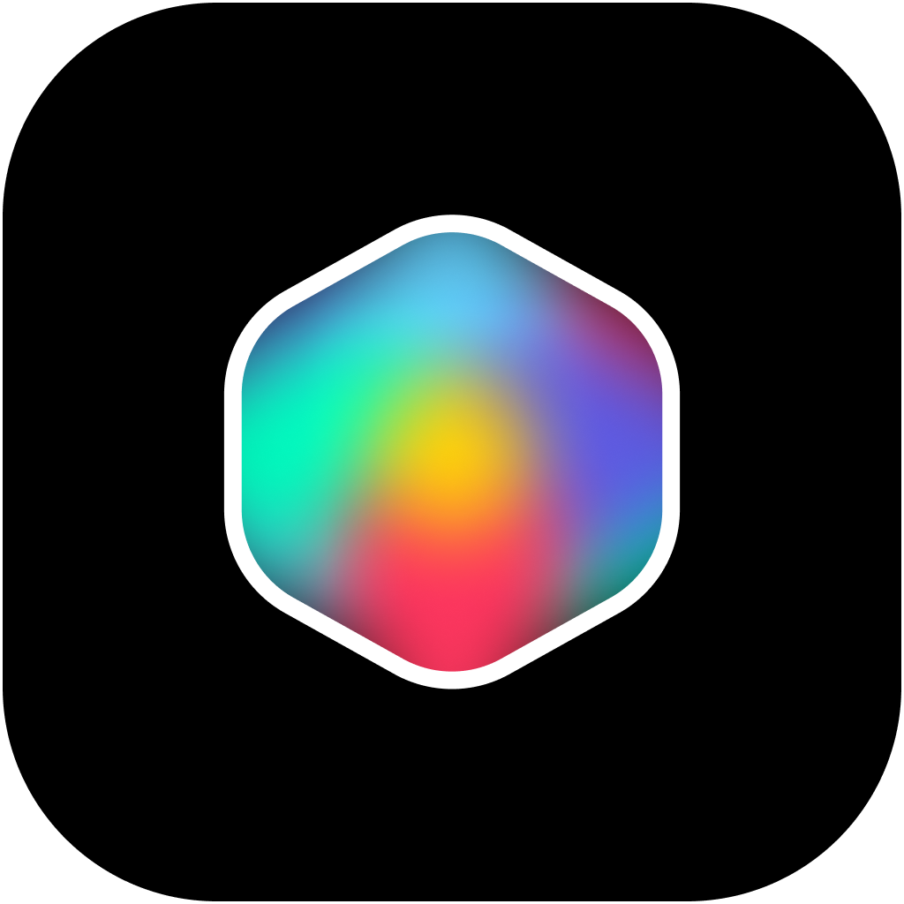
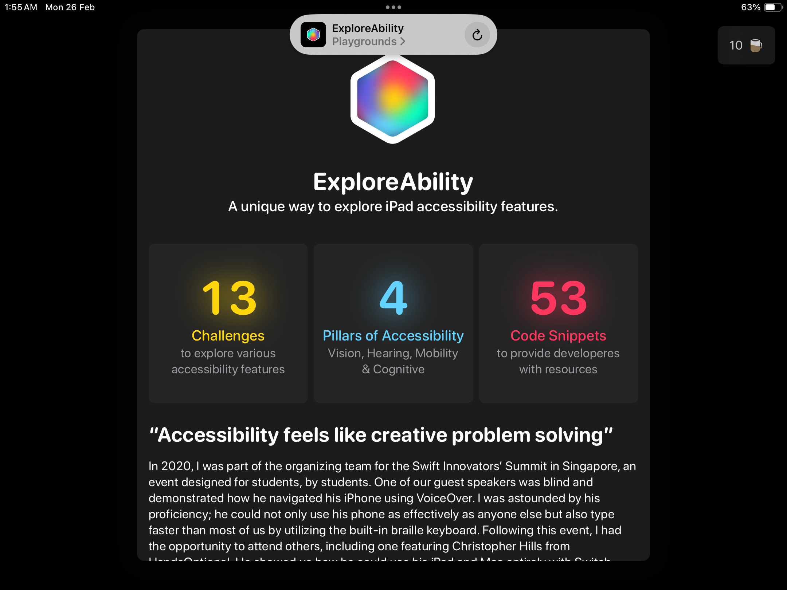
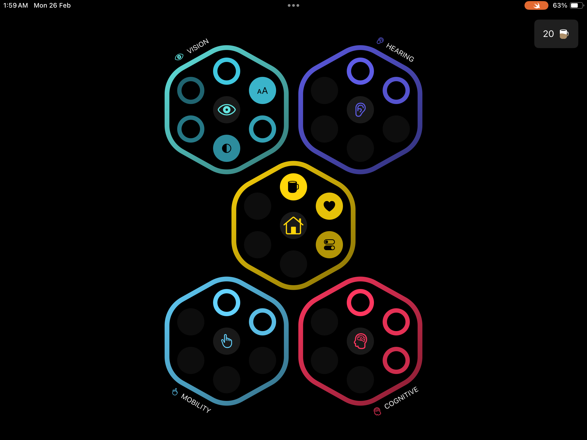
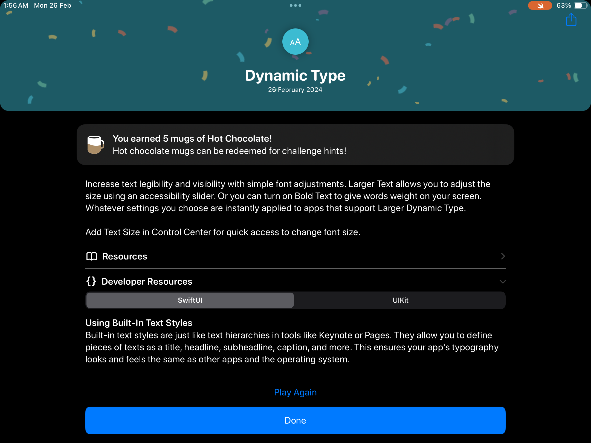

# ExploreAbility

## WWDC2024 Swift Student Challenge

## Features
Explore various Accessibility features of iPad with ExploreAbility.

Inspired by Blackbox, ExploreAbility uses various challenges to teach users about the accessibility features on their iPad. The app also teaches developers and designers to build apps that best support these features by providing external links to the Human Interface Guidelines, Developer Documentation, and Developer Videos. The app features 13 unique challenges, covering 4 pillars of accessibility—Vision, Cognitive, Hearing, and Mobility, and over 50 code snippets for developers to understand how to best support these features in their apps.

### Technologies 
#### SwiftUI, UIKit, Combine
Used to create the interface, design the challenges, animations, and manage state. 

#### AVFoundation, CoreMotion, SpriteKit
Used in the implementation of certain challenges like MonoAudio and ShakeToUndo. 

#### Accessibility, MediaAccessibility
Used to validate the results of the challenges (and listen to changes to the user's accessibility settings). QuartzCore: Confetti animations when a user finishes a challenge successfully. 

<h4>Spoiler</h4>

To help you test it out, here is the solution to one challenge: 

Under Vision, the challenge furthest to the trailing edge, towards the top is on _Dynamic Type_. 

In order to enable it, go to Settings > Accessibility > Display & Text Size > Larger Text, and drag the slider to max.

## Screenshots
 

## Comments
The app does take a second to boot up when compiling with Swift Playgrounds on iPad. 
If a white screen appears on first boot, tap on the Swift Playgrounds logo and press Restart. That usually seems to fix it.

This appears to be a bug within Swift Playgrounds itself.
